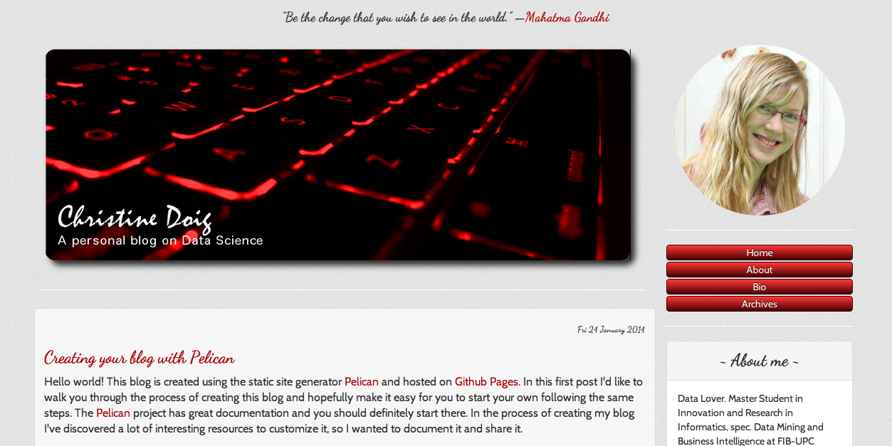
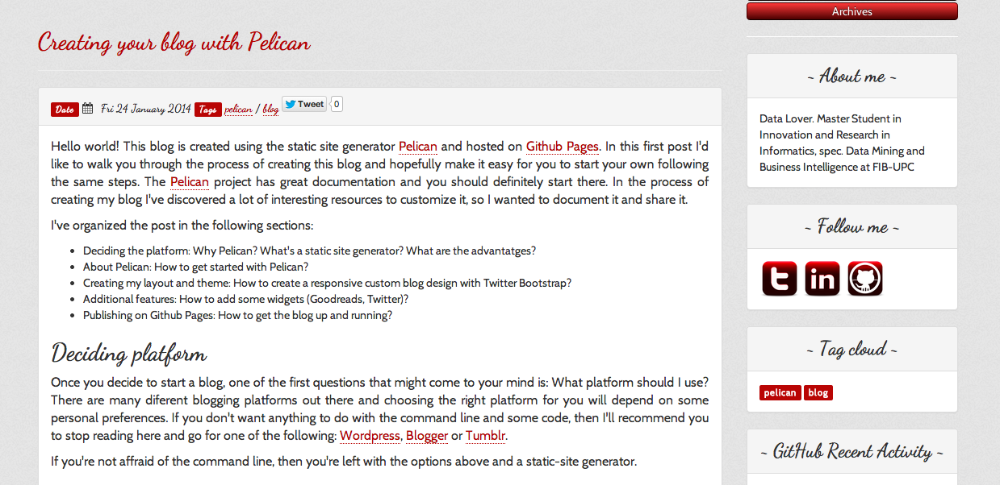

# Pelican-bootstrap3-lovers

Lovers is a Bootstrap 3 theme for Pelican.


## Installation

First:

`git clone https://github.com/chdoig/pelican-bootstrap3-lovers.git`

Then:

In your `pelicanconf.py` file:

Point the `THEME` variable to `/path/to/pelican-bootstrap3-lovers` and set a `BOOTSTRAP_THEME` variable to `lovers`. 

Note: This theme is compatible with other Bootstrap themes. Just copy the CSS files of the theme you want to use to the `static/css/` folder named as `bootstrap.{theme-name}.min.css`and set the `BOOTSTRAP_THEME` to `theme-name`. You can find some nice themes at [Bootswatch](http://bootswatch.com/) and get the CSS files from there or at [pelican-bootstrap3](https://github.com/DandyDev/pelican-bootstrap3). For adding customizations on a theme you can create a file named `style.{theme-name}.min.css` and add them there.

## Usage

This theme already incorporates some standard Pelican Plugins and allows the following settings from your `pelicanconf.py` file:

* Template:
	* `HEADER_IMAGE`
	* `PROFILE_PICTURE`
	* `DISPLAY_PAGES_ON_MENU`
	* `GOODREADS_ID`
* Sidebar-widgets:
	* `ABOUT_ME`
	* `TAG_CLOUD`
	* `GITHUB_USER`
	* `TWITTER_WIDGET_ID`
* Analytics & Comments:
	* `GOOGLE_ANALYTICS`
	* `DISQUS_SITENAME`

Note: This theme uses [Prism](http://prismjs.com/) instead of Pygments for syntax higlighting. (More details in the Prism.js section).

Details for each of the mentioned settings are provided next.

## Template settings

### HEADER_IMAGE

To add your header image, save the image under:

~~~~{.bash}
  yourproject/
  └── content/
      └── images/
          └──yourheaderimage.png
~~~~    

and add the following lines in your `pelicanconf.py` file:

~~~~{.python}
STATIC_PATHS = ['images']
HEADER_IMAGE = "yourheaderimage.png"
~~~~

### PROFILE_PICTURE

To set your profile picture, save your profile image under the same folder as the header image:

~~~~{.bash}
  yourproject/
  └── content/
      └── images/
          └──yourprofilepicture.png
~~~~   

and add the following line to your `pelicanconf.py` file:

~~~~{.python}
STATIC_PATHS = ['images']
PROFILE_PICTURE = "yourprofilepicture.png"
~~~~ 

### DISPLAY_PAGES_ON_MENU

If you'd like Pages to be displayed in the Menu (in this theme, under your profile picture):

~~~~{python}
DISPLAY_PAGES_ON_MENU = True
~~~~ 

### GOODREADS_ID

The Goodreads widget displays a random quote from your Goodreads quote list at the top of your blog. To set it up:
Get your `GOODREADS_ID` by going to your Goodreads profile. The url will be: 

`https://www.goodreads.com/user/show/GOODREADS_ID`

## Sidebar widgets

### ABOUT_ME

If you want a sidebar widget with a brief description of yourself just:

~~~~{python}
ABOUT_ME = "Whatever you want to say about yourself"
~~~~ 

### TAG_CLOUD

It uses the `tag_cloud` variable for displaying tags in the sidebar. You can control the amount of tags shown with: `TAG_CLOUD_MAX_ITEMS`.

### GITHUB_USER

The theme can show your most recently active GitHub repos in the sidebar. To enable, provide a `GITHUB_USER`. Appearance and behaviour can be controlled using the following variables:

* `GITHUB_REPO_COUNT`
* `GITHUB_SKIP_FORK`
* `GITHUB_SHOW_USER_LINK`

### TWITTER_WIDGET_ID

To get a `TWITTER_WIDGET_ID`, go to: https://twitter.com/settings/widgets and `Create new`. You'll find the `TWITTER_WIDGET_ID` under the html or in the site url:

`https://twitter.com/settings/widgets/TWITTER_WIDGET_ID/edit`

The set up:

~~~~{.python}
TWITTER_USERNAME = XXXXX
TWITTER_WIDGET_ID = XXXXX
~~~~

## Prism.js for syntax highlighting

The theme is set up to use [Prism](http://prismjs.com/) instead of Pygments for syntax highlighting.

When using Markdown you'll need to write your code like this with the aproppriate `language-XXXX`(e.g. language-python, language-css, etc):

```
  ~~~~{.language-XXXX}
  	YOUR CODE HERE
``` 

Make sure you're not using `codehilite(css_class=highlight)`, e.g. `pelicanconf.py` file:

~~~~{.language-python}
MD_EXTENSIONS = ['extra']
~~~~ 


If you'd rahter keep using Pygments in your blog, just set it up in `base.html` to:

~~~~{.markup}
    <link href="{{ SITEURL }}/theme/css/pygments.css" rel="stylesheet">
    <!--link href="{{ SITEURL }}/theme/css/prism.css" rel="stylesheet" /-->
    <!--script src="{{ SITEURL }}/theme/js/prism.js"></script-->
~~~~

And leave the MD_EXTENSIONS to:

~~~~{.language-python}
MD_EXTENSIONS = ['codehilite(css_class=highlight)']
~~~~ 

## Analytics & Comments:

This theme uses [Google Analytics](www.google.com/analytics) and [Disqus](http://disqus.com/) for comments. You'll need to get your Google analytics Tracking ID and your disqus_sitename. Visit their respectives websites to find out how to get these IDs and copy them into your `pelicanconf.py`:

~~~~{.python}
GOOGLE_ANALYTICS = XXXXX
DISQUS_SITENAME = XXXXX
~~~~

## Screenshot





## Live example

[This is my website](http://chdoig.github.io)

For detailed information on how to customize your Pelican blog, check my [blogpost](http://chdoig.github.io/create-pelican-blog).

## Thanks

I would like to thank [DandyDev](http://dandydev.net/) for [pelican-bootstrap3](https://github.com/DandyDev/pelican-bootstrap3). That was my starting point for creating this theme and it includes some of the settings he made available.